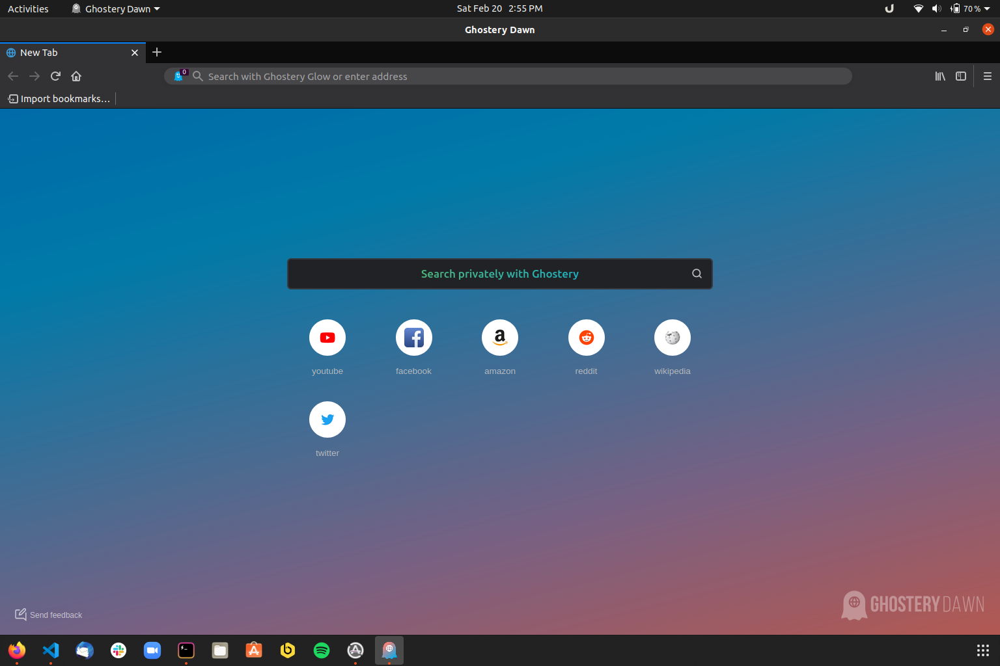

<h1 align="center">
  
  <br />
  Ghostery Dawn
</h1>

[](https://snapcraft.io/ghostery-dawn/builds)

<p align="center"><b>This is a snap for Ghostery Dawn</b>, <i>“The Privacy Browser”</i>.





<p align="center">Published for  with 💝 by Fcjr</p>

## Install

```sh
sudo snap install --edge --devmode dawn
```

([Don't have snapd installed?](https://snapcraft.io/docs/core/install))
